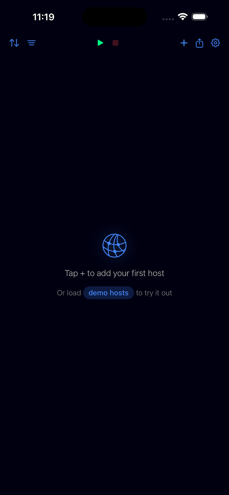
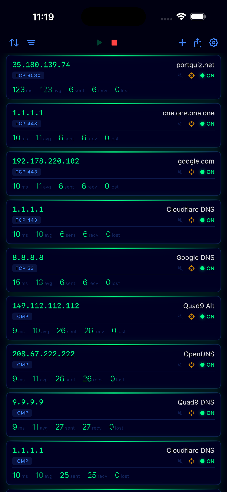
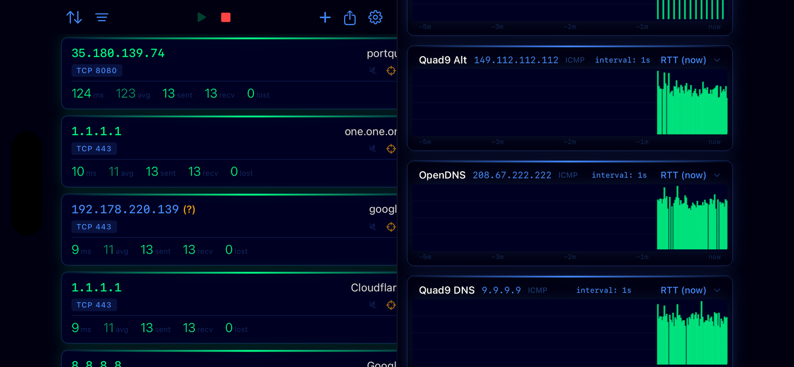
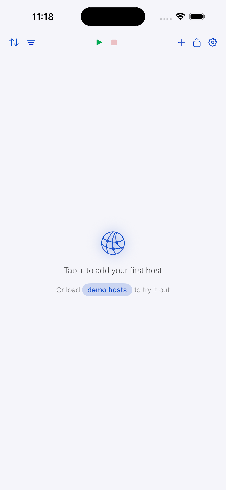
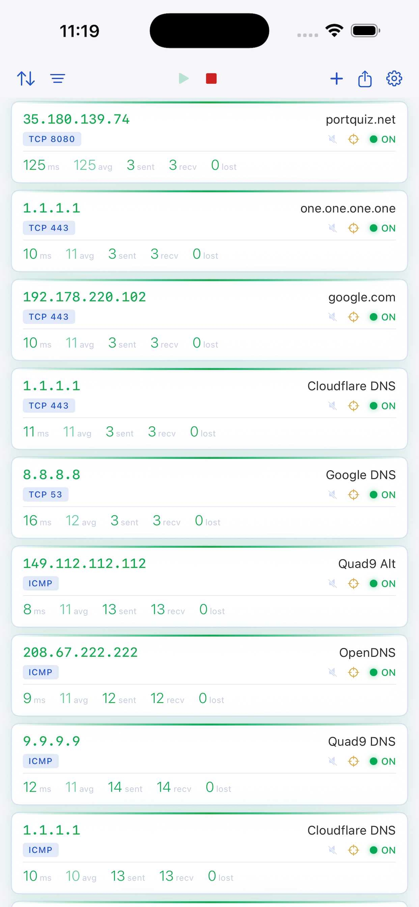
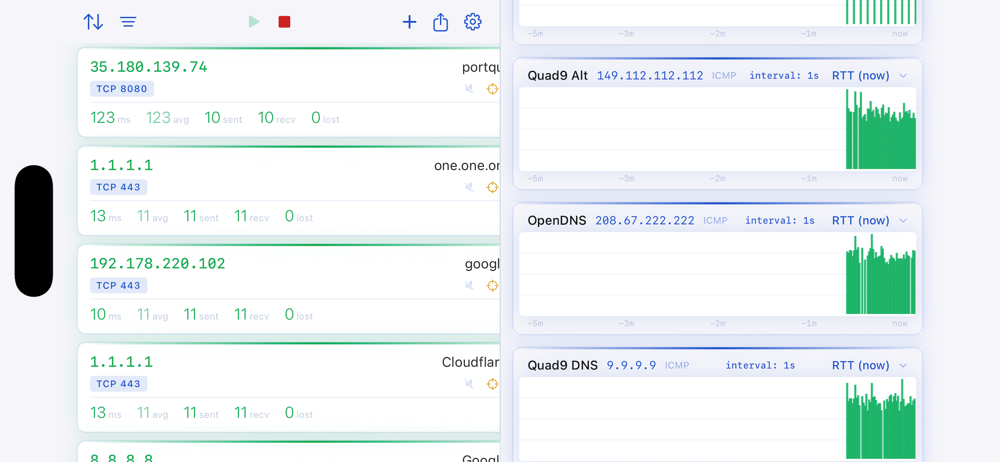
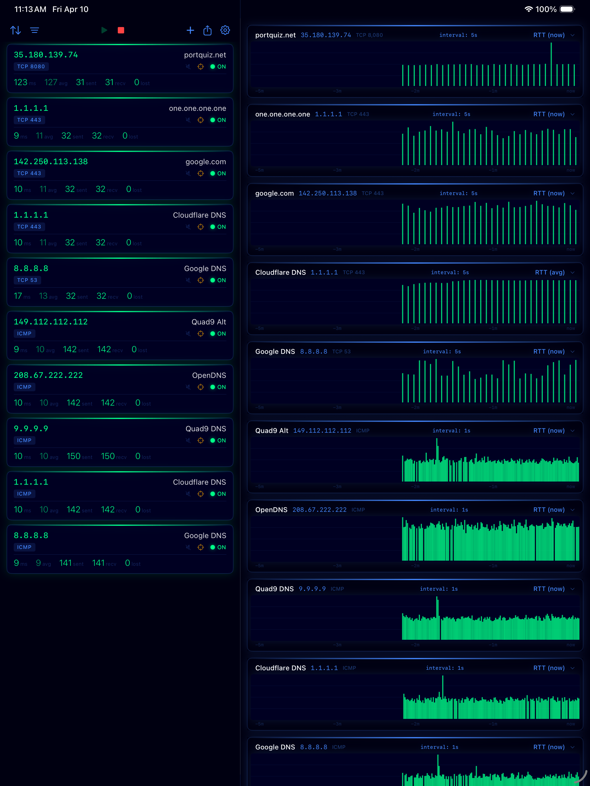
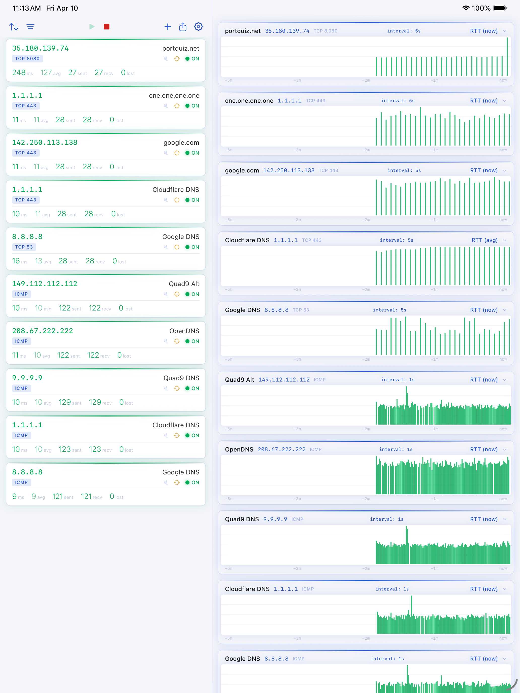
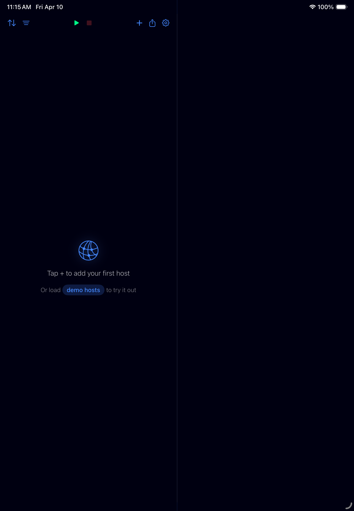
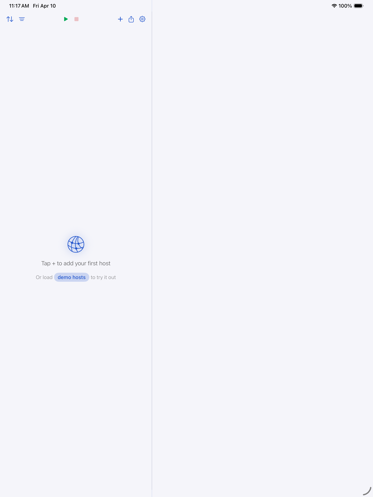

<p align="center">
  
</p>

<h1 align="center">PingyDingy</h1>

<p align="center">
  A real-time network monitor for iOS and iPad with audible alerts and a futuristic neon interface.
</p>

<p align="center">
  
  
  
  
</p>

---

PingyDingy monitors your hosts via ICMP or TCP and tells you the moment something goes wrong -- with sounds, colors, and real-time charts. Built for network engineers, homelab operators, and anyone who needs to know when a service drops.

## Features

**Multi-Host Monitoring**
- Monitor up to 64 hosts simultaneously via ICMP ping or TCP connect
- Configurable intervals from 1 second to 10 minutes per host
- DNS re-resolution every 60 seconds with visual change alerts
- IPv4 and IPv6 support

**Real-Time Dashboard**
- Compact card view in portrait with live RTT, average, sent/received/lost counts
- Scrolling RRD-style histogram charts in landscape mode
- iPad split view: host list + charts side by side
- Pinch-to-zoom on the time axis (30 seconds to 1 hour)
- Tap charts to cycle through metrics: RTT, average RTT, sent, lost, received

**Audible Alerts**
- **Per-ping sound** -- hear every success and failure as it happens (speaker icon)
- **Transition alerts** -- distinct sounds when a host goes down or comes back up (scope icon)
- Both controls are tappable directly on each host card
- Global master sound toggle in Settings
- 60-second cooldown on transition alerts to prevent overload

**Data & Export**
- All ping results logged to on-device SQLite database
- Export to CSV or JSON with operator-friendly filenames: `YYYYMMDDhhmm-YYYYMMDDhhmm_hostname_tcp443.csv`
- Time range presets (last hour, 24h, 7 days, all) or custom date range
- Share via AirDrop, Files, email, or any iOS share target
- 90-day data reminder when logs get old

**Sort & Filter**
- Sort by: time added, hostname, last RTT, average RTT, last response, last loss, loss %, status
- Filter by: up, down, ICMP, TCP, logging enabled, slow responders (>500ms)
- Neon-styled filter chip bar

**Design**
- "Tron Minimal" theme with neon glow borders and status-colored elements
- Full dark mode and light mode support
- Top-edge glow lines on each card indicate host status at a glance
- DNS change indicator: IP turns blue with an amber (?) badge

## Screenshots

### iPhone — Dark Mode
<p>
  
  
  
</p>

### iPhone — Light Mode
<p>
  
  
  
</p>

### iPad — Split View (Host Cards + Live Histograms)
<p>
  
</p>
<p>
  
</p>

### Add Host & Settings
<p>
  
  
</p>

## Requirements

- iOS 17.0+ / iPadOS 17.0+
- Xcode 15.0+
- Swift 5.9+
- No third-party dependencies -- built entirely with Apple frameworks

## Getting Started

```bash
git clone https://github.com/dallascyclist/pingydingy.git
cd PingyDingy
```

**Open in Xcode:**

```bash
open PingyDingy.xcodeproj
```

Select your development team under the PingyDingy target's Signing settings, then build and run (Cmd+R).

**Run tests via command line:**

```bash
swift test
```

## Architecture

PingyDingy is built with pure SwiftUI and SwiftData -- zero third-party dependencies.

```
PingyDingy/
  Models/          SwiftData persistence (HostConfiguration, PingResult, DNSResolution)
  Engine/          Networking core
    PingTransport    Protocol abstraction for ping implementations
    ICMPTransport    Unprivileged ICMP socket (SOCK_DGRAM)
    TCPTransport     NWConnection-based TCP connect + close
    DNSResolver      POSIX getaddrinfo with change detection
    HostMonitor      Per-host async ping loop with live stats
    MonitoringEngine Orchestrator managing all monitors + SwiftData persistence
    SoundManager     AVAudioPlayer with per-host cooldown tracking
  Theme/           Tron Minimal color tokens and neon ViewModifiers
  Views/           SwiftUI views (portrait cards, landscape histograms, sheets)
  Utilities/       CSV/JSON export, data retention checks
```

**Key design decisions:**

- `PingTransport` protocol abstracts the transport layer so ICMP can be swapped from unprivileged sockets to raw sockets (via Network Extension) without touching the rest of the codebase
- `HostMonitor` and `MonitoringEngine` are `@Observable @MainActor` for safe SwiftUI binding under Swift 6 strict concurrency
- Canvas-based histogram rendering for smooth 30fps scrolling with no framework overhead
- Sound playback uses pre-loaded `AVAudioPlayer` instances for zero-latency response

## Sound Files

Place your own sound files in `Sounds/` or use the included defaults:

| File | Purpose |
|------|---------|
| `ping.mp3` | Played on each successful ping (when per-ping sound is on) |
| `noping.mp3` | Played on each failed ping (when per-ping sound is on) |
| `tada.mp3` | Played when a host comes back up (transition alert) |
| `Wahwahwah.mp3` | Played when a host goes down (transition alert) |

## Roadmap

- [ ] Network Extension entitlement for raw ICMP sockets
- [ ] Background monitoring via Network Extension
- [ ] Traceroute visualization
- [ ] Host groups and profiles
- [ ] iCloud sync of host configurations
- [ ] Widgets for home screen status

## License

MIT License. See [LICENSE](LICENSE) for details.
